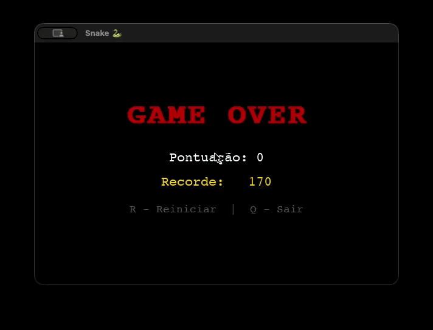

# 🐍 Cobra Pygame



Jogo da Cobrinha feito com **Python** e **Pygame**. Este é um projeto de estudo para lógica de programação e desenvolvimento de jogos.

## 🚀 Como rodar

```bash
# Instalar dependências
pip install pygame numpy

# Rodar o jogo
python3 main.py
```

## 🎮 Controles

| Tecla       | Ação               |
| :---------- | :----------------- |
| ⬆️ ⬇️ ⬅️ ➡️ | Mover a cobra      |
| **P**       | Pausar / Continuar |
| **R**       | Reiniciar          |
| **Q**       | Sair               |

## 🛠️ Tecnologias

- Python 3
- Pygame
- Numpy

---

Desenvolvido por **Osmar Junior** (osmar.cyber.dev)
